# Assignment 8

\rule{\linewidth}{0.5mm}

## Effect of SincP on the graph of wave

- The following graph shows the variation of graph as `SincP` is changed for two different values of `SincP` for the function
$$sinc(SincP* t)$$

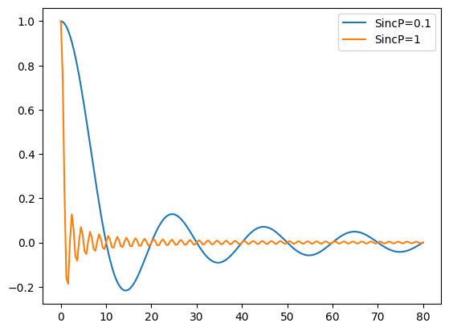

\rule{\linewidth}{0.5mm}

## Reconstructed Data for the Datasets Given

Given below are reconstructed data for the two datasets `rx1.txt` and `rx2.txt`:

- rx2.txt
    
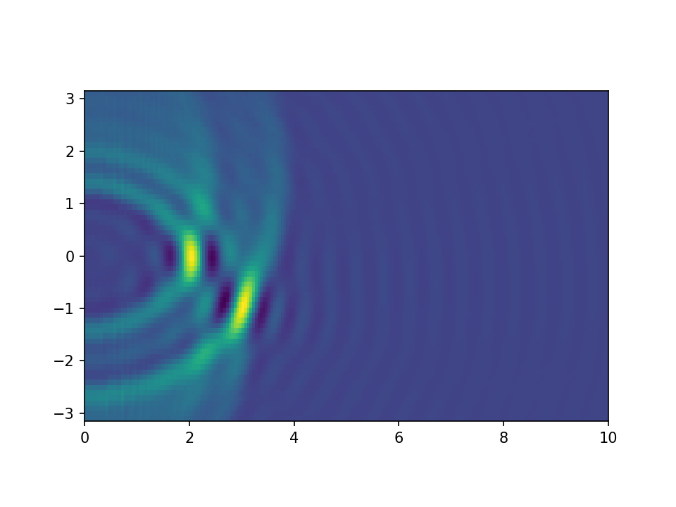

- rx3.txt

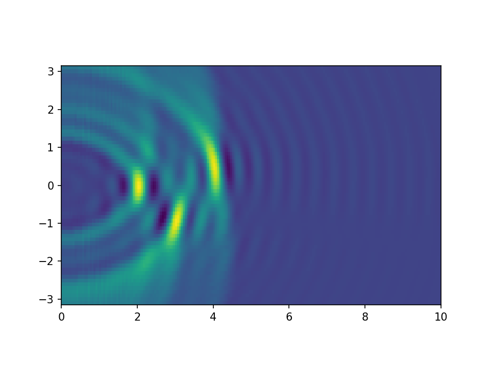

\rule{\linewidth}{0.5mm}

## Heatmap for Different `Nmics` and `Nsamp`

1. `Nmics`=8, `Nsamp`=50

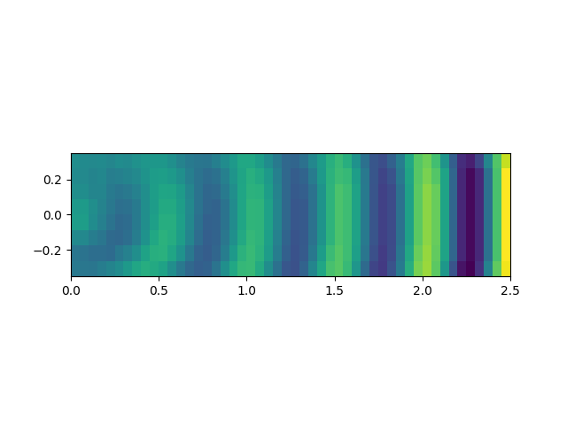 

2. `Nmics`=8, `Nsamp`=100

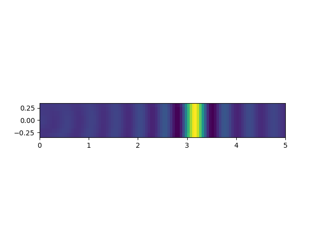{ width=70% }

3. `Nmics`=8, `Nsamp`=200

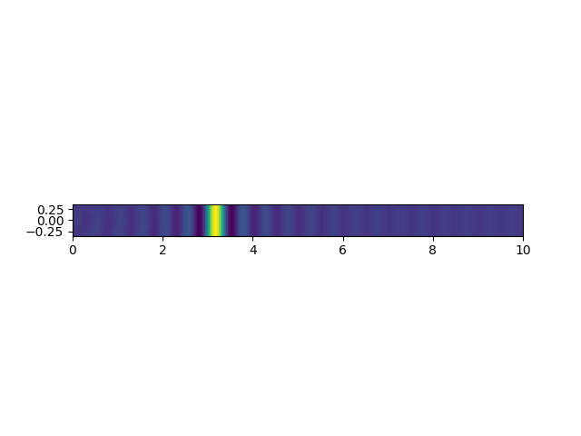

4. `Nmics`=32, `Nsamp`=50

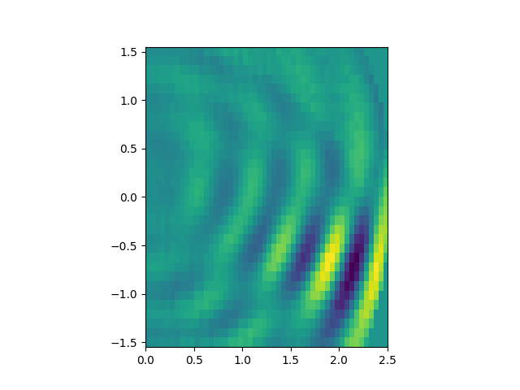

5. `Nmics`=32, `Nsamp`=100

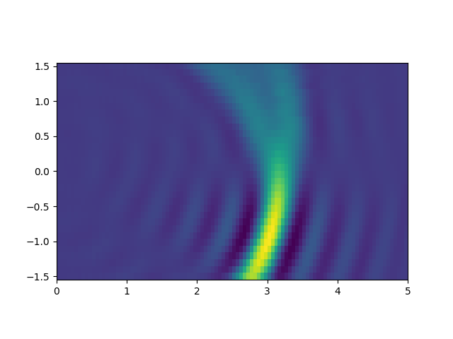 

6. `Nmics`=32, `Nsamp`=200

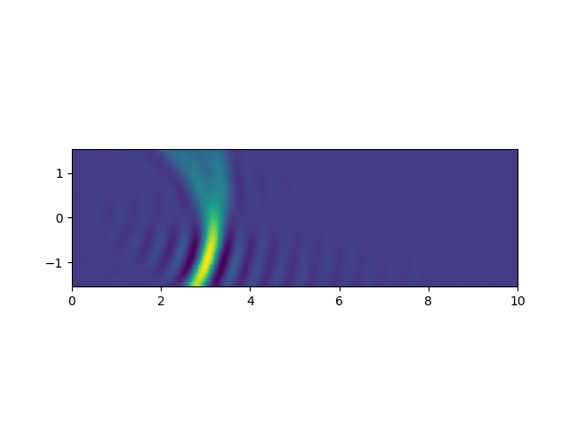{ width=70% }

7. `Nmics`=64, `Nsamp`=50

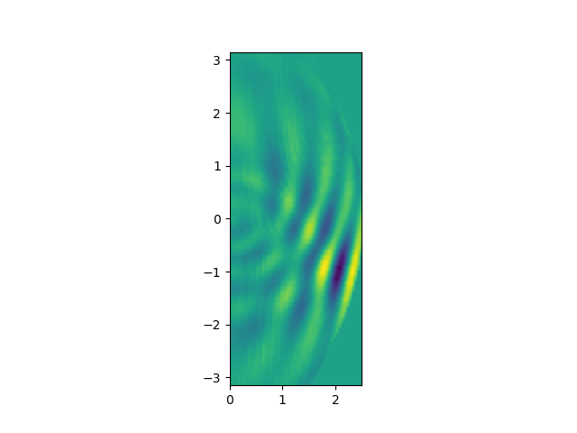

8. `Nmics`=64, `Nsamp`=100

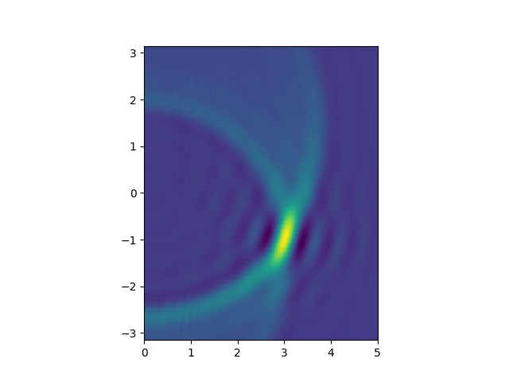

9. `Nmics`=64, `Nsamp`=200

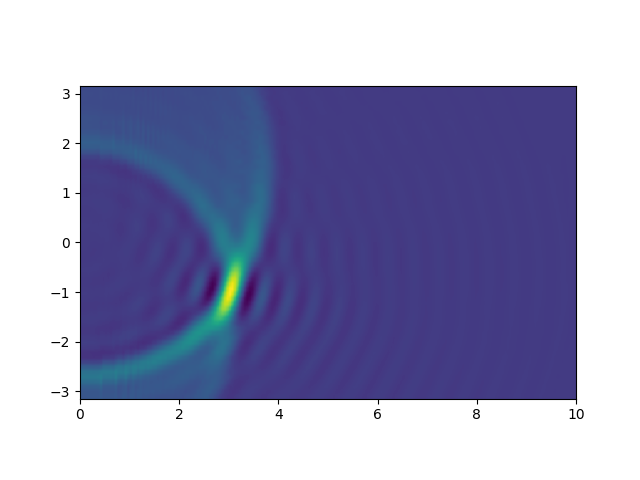